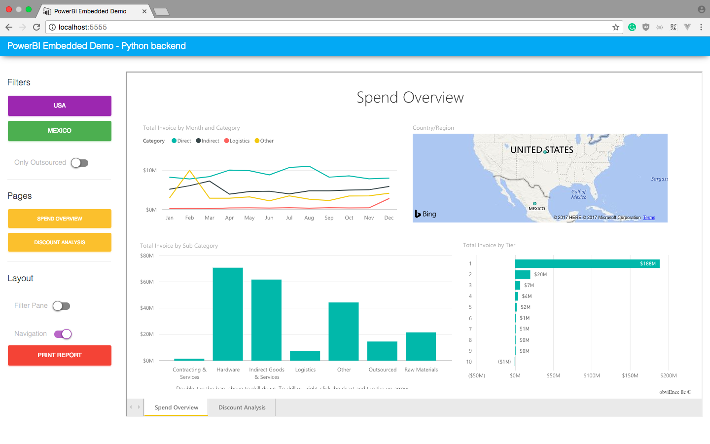
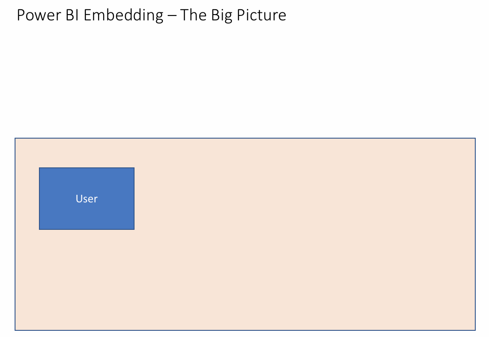

## PowerBI Premium Embedding (aka PowerBI Embedded v2) Demo

This demonstrates the **[App Owns Data](https://powerbi.microsoft.com/en-us/documentation/powerbi-developer-embed-sample-app-owns-data/)** (3rd party embedding) approach.

Demo uses the [PowerBI Sample Procurement Analysis](https://powerbi.microsoft.com/en-us/documentation/powerbi-sample-procurement-analysis-take-a-tour/)  report from the PowerBI sample gallery (_Get data_). 
Publish to **App Workspace**, not _My Workspace_, this is important. It should be the only report in your App Workspace, otherwise you'll need to change the backend to return its index from the result array.

Material Design controls borrowed from [Creative Tim](https://www.creative-tim.com/product/material-kit). 
TODO: Swap Material Design for [Fluent Design System](https://fluent.microsoft.com) (Project Neon).

You can test drive the demo here: http://powerbi-static-frontend.azurewebsites.net/

Original contributors (Microsoft):
- Andrey Vykhodtsev - https://github.com/vykhand
- Adrian Calinescu - https://github.com/snobu

Pull Requests are more than welcome.

### Legend

**backend-as-func** 
C# HTTP Trigger Azure Function acting as backend (returns embed token).

**frontend-as-webapp** 
HTML5/JavaScript frontend with jQuery `.click()` event handlers to control the embedded report.

**python-flask** 
A Flask application containing both frontend and backend (in Python this time):
- Add your secrets to `secrets.sh`
- Add `secrets.sh` to `.gitignore` (avoid accidental publishing of secrets)
- Run `make dep_install` to install required Python3 dependencies
- Start the Flask app with `make run`

Last frame of this GIF is conviniently provided [as PNG](oauth-dance.png).

Slide borrowed from this highly recommended video on v2 embedding -

