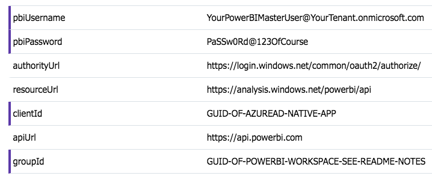

### Wait, where do i get that Workspace ID from?

1. Login to https://dev.powerbi.com with your PowerBIMaster account (that has the Premium subscription).
2. Go to **Workspaces -> App Workspaces** and pick the App Workspace you'll deploy the sample report to.
3. The Workspace is the GUID after `/groups/` 
   (i.e. `https://msit.powerbi.com/groups/c692d43d-xxxx-xxxx-xxxx-xxxxxxxx/groupwelcome)

Your Function App's _Application Settings_ need to look close to this:

